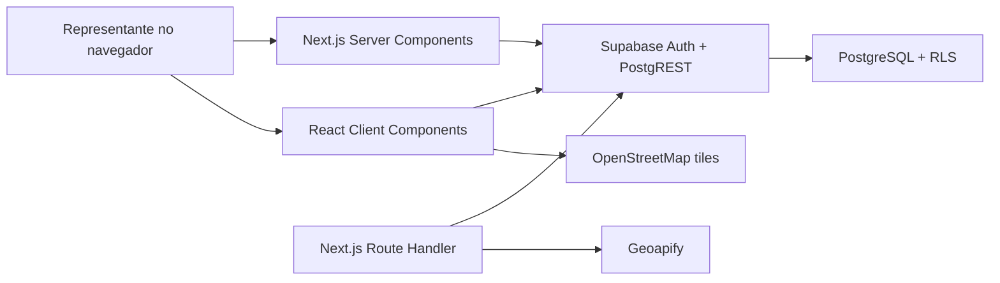
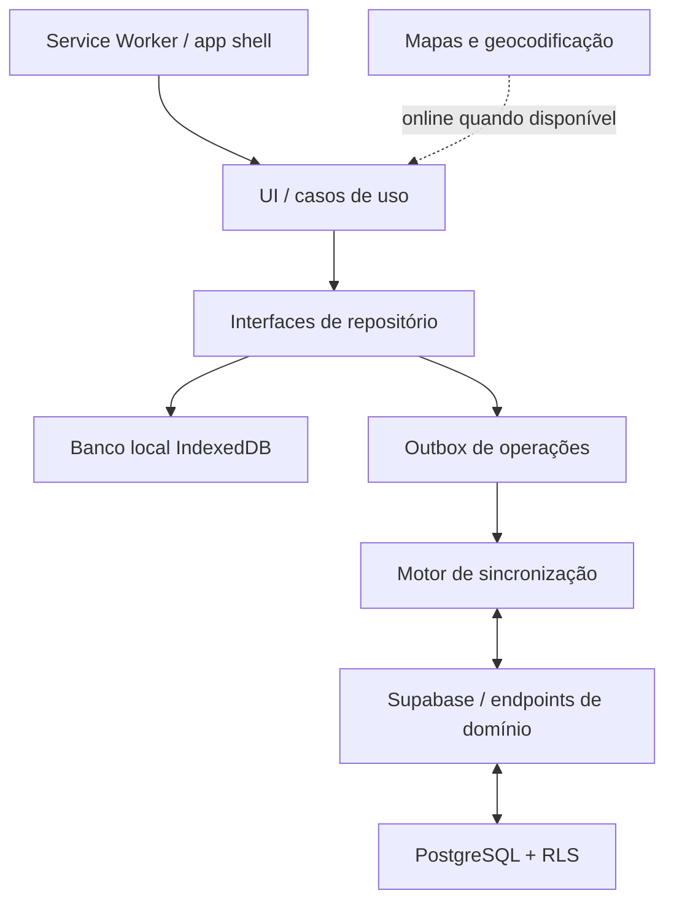

# Arquitetura do RotaComercial

## Objetivo

Este documento descreve o estado observado no repositório e uma arquitetura-alvo offline-first. Ele não autoriza mudanças de schema nem substitui a inspeção do Supabase antes de migrations.

## Arquitetura atual

O produto é um monólito web mobile-first em Next.js 16, App Router, React 19, TypeScript e Tailwind CSS. Supabase fornece PostgreSQL, Auth e acesso a dados protegido por RLS.

### Next.js e frontend

- Server Components protegem e carregam `/`, `/clientes`, fichas, edição e `/planejamento`.
- Client Components tratam login/logout, busca local, formulários e todas as mutações de planejamento.
- Não há middleware global de autenticação; cada página protegida chama `auth.getUser()` e redireciona.
- Não há camada compartilhada de domínio, repositórios ou casos de uso.
- Os tipos das entidades são interfaces locais e parcialmente duplicadas.

### Supabase, Auth, PostgreSQL e RLS

- Existem clientes Supabase separados para navegador e servidor.
- O browser usa publishable key e sessão persistida pelo SDK.
- Server Components e Route Handlers usam cookies da sessão.
- A aplicação depende de RLS para restringir `clientes`, `visitas` e `planejamento` ao usuário autenticado.
- Inserts incluem `user_id` recebido de `auth.getUser()`; updates/deletes normalmente filtram por `id` e confiam na RLS.
- O repositório não contém definição completa e versionada do schema/policies; o banco real continua sendo a referência.

### Fluxos atuais

| Área | Leitura | Escrita | Estado local |
| --- | --- | --- | --- |
| Clientes | Server Component | Browser → Supabase | formulário em memória |
| Visitas | ficha no servidor | Browser → Supabase | formulário em memória |
| Planejamento | servidor carrega rota/clientes/visitas | Browser → Supabase | rota do dia em `useState` |
| Geolocalização GPS | navegador | salva junto do cliente | formulário em memória |
| Geocodificação | Route Handler → Geoapify | confirmação salva pelo browser | prévia em memória |
| Mapa | pontos da rota em memória | nenhuma | Leaflet no browser |

### Mapas e serviços externos

- Leaflet renderiza tiles públicos do OpenStreetMap; não há cache offline controlado.
- A linha no mapa representa sequência, não trajeto viário.
- Navegação externa usa URL pública do Google Maps.
- Geoapify é chamado server-side com segredo; depende de autenticação, rede e disponibilidade do provedor.

## Limitações para offline-first

- A primeira leitura de cada página protegida exige rede e sessão válida no servidor.
- Dados úteis não são persistidos localmente.
- Reload offline perde rota e formulários.
- Escritas chamam Supabase diretamente e não podem ser enfileiradas.
- IDs de novos clientes/visitas são gerados implicitamente pelo banco.
- Não existe `updated_at`, versão ou tombstone confirmado no modelo observado.
- Reordenação faz duas ou mais atualizações independentes, sujeitas a estado parcial.
- `router.refresh()` é usado como reconciliação, sempre dependente da rede.
- Logout não possui limpeza de uma futura base local por usuário.

## Arquitetura-alvo

O alvo é um local-first moderado: a interface lê e escreve primeiro em uma base local por usuário; a sincronização assíncrona replica operações para o Supabase quando houver sessão e conectividade. PostgreSQL/RLS permanece a fonte autoritativa compartilhada.

### Princípios

1. UI não chama Supabase diretamente.
2. Casos de uso aplicam regras de domínio e gravam localmente de modo atômico.
3. Toda mutação sincronizável produz uma operação na outbox na mesma transação local.
4. IDs UUID são criados no cliente antes da sincronização.
5. RLS continua obrigatória; cache local não é uma fronteira de autorização.
6. Dados locais são particionados por `user_id` e limpos no logout.
7. Estado de sincronização é visível e nunca apresentado como “salvo na nuvem” antes da confirmação.
8. PWA, Service Worker e cache de assets entram somente depois de dados/sync estarem testados.

### Responsabilidades futuras

- **Camada de domínio:** entidades, invariantes, comandos e políticas de conflito.
- **Repositórios:** contratos para clientes, visitas e rota; implementações local/remota.
- **Armazenamento local:** projeções para leitura e outbox; escolha detalhada no ADR 002.
- **Motor de sincronização:** push ordenado, pull incremental, retries, idempotência e conflitos.
- **PWA:** app shell, assets versionados, atualização segura e experiência de instalação.
- **Backend:** operações que exigem atomicidade ou integração secreta; sem `service_role` por padrão.

## Fronteiras de componentes

Server Components continuam úteis para bootstrap online, páginas públicas e render inicial. Após hidratação, telas operacionais devem consultar repositórios locais. Client Components não devem conter SQL/PostgREST, regras de conflito ou ordenação persistente. Route Handlers devem ser reservados a integrações secretas e comandos compostos que não possam ser executados atomicamente por PostgREST/RPC.

## Auditoria do código

### Acoplamentos e duplicações

- Páginas conhecem nomes de tabelas e payloads Supabase.
- Formulários misturam UI, validação, autenticação, persistência e navegação.
- Tipos `Cliente` e validações de coordenadas/endereço estão duplicados.
- Autenticação é repetida em várias páginas.
- Montagem e formatação de endereço aparecem em ficha, planejamento e geocodificação.
- Status da rota é tratado como `string`, não como tipo de domínio compartilhado.
- `AdicionarPlanejamentoButton` duplica parte do fluxo hoje concentrado em `planejamento-client.tsx` e aparenta não ser usado.

### Lógica de negócio em componentes

- Próxima ordem, remoção com compactação e troca de ordem ficam em `planejamento-client.tsx`.
- Registrar visita e marcar planejamento como visitado são duas operações remotas separadas.
- Metadados de localização são definidos no formulário de edição.
- Critérios de aceitação da geocodificação estão no adaptador do provedor, sem testes automatizados.

### Dependências integrais de rede

- login e validação de sessão;
- todas as páginas protegidas em reload/navegação server-side;
- cadastro/edição de cliente;
- registro e histórico de visitas;
- leitura e mutações da rota;
- geocodificação, tiles e navegação externa.

## Technical Debt / Migration Plan

### P0 — pré-requisitos de consistência e segurança

1. Versionar e testar schema, constraints e policies reais.
2. Introduzir `updated_at`, estratégia de versão e contrato de exclusão/tombstone antes do sync.
3. Definir UUID gerado no cliente e idempotency key para novas entidades.
4. Tornar “registrar visita + concluir parada” uma operação atômica/idempotente.
5. Tornar reordenação um comando de rota atômico com versão da rota.
6. Criar tipos e validações de domínio compartilhados.
7. Definir política de limpeza local no logout/troca de usuário.

### P1 — desacoplamento necessário ao offline

1. Extrair contratos de repositório e casos de uso.
2. Remover chamadas Supabase de componentes gradualmente.
3. Prototipar IndexedDB direto e Dexie com volume real.
4. Implementar base local particionada e outbox transacional.
5. Implementar sync mínimo para leitura, visita e status da rota.
6. Exibir estado local: pendente, sincronizando, sincronizado, conflito e falha.

### P2 — robustez e evolução

1. Service Worker e PWA após o sync estabilizar.
2. Cache controlado de mapas ou fallback sem mapa, respeitando licenças.
3. Observabilidade de sincronização sem registrar dados sensíveis.
4. Testes de caos/rede e migração de banco local.
5. Consolidar layout, metadata, acessibilidade e estados visuais.
6. Planejar motor de rotas atrás de interface substituível.

## Fora de escopo desta sprint

Nenhuma camada descrita como futura foi implementada. Não houve mudança de banco, RLS, dependências, IndexedDB, Service Worker ou sincronização.
