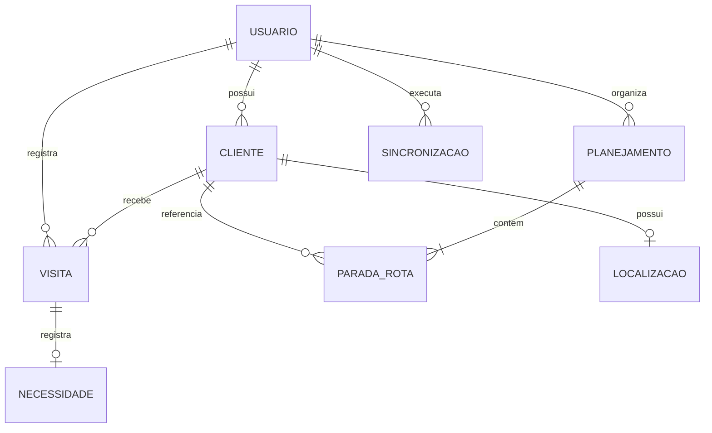

# Modelo de domínio

## Visão geral

O código atual persiste três agregados principais (`clientes`, `visitas`, `planejamento`). Os demais conceitos abaixo são explícitos no produto, mas alguns ainda são campos ou projeções, não entidades próprias.

## Usuario

**Responsabilidade:** identidade autenticada e proprietário dos dados comerciais.

**Campos relevantes:** `id` do Supabase Auth, e-mail e sessão. Tabelas de domínio usam `user_id`.

**Relações:** possui clientes, visitas, planejamentos e futuramente uma partição local/sessão de sincronização.

**Regras e invariantes:**

- somente acessa dados cujo `user_id = auth.uid()`;
- uma sessão local nunca pode misturar dados de usuários;
- logout invalida acesso e deve limpar dados locais futuros.

## Cliente

**Responsabilidade:** representar o estabelecimento atendido e seus dados de contato/endereço.

**Campos observados:** `id`, `user_id`, `codigo`, `nome`, `nome_fantasia`, `bairro`, `endereco`, `numero`, `complemento`, `cidade`, `estado`, `cep`, `pais`, `telefone`, `observacoes`, `latitude`, `longitude`, metadados de localização e `created_at`.

**Relações:** pertence a um usuário; recebe visitas; pode aparecer uma vez por data no planejamento; pode possuir localização.

**Invariantes:**

- `nome` é obrigatório;
- UF e país, quando presentes, usam duas letras maiúsculas;
- CEP, quando presente, usa oito dígitos;
- latitude e longitude devem existir em conjunto e respeitar seus intervalos;
- código não deve ser assumido globalmente único sem constraint confirmada.

## Visita

**Responsabilidade:** registrar um atendimento realizado a um cliente.

**Campos confirmados:** `id`, `user_id`, `cliente_id`, `visitado_em`, `resultado`, `necessidade`, `observacoes`, `created_at`.

**Relações:** pertence a usuário e cliente; pode concluir a parada correspondente da rota do dia.

**Invariantes:**

- cliente e visita devem pertencer ao mesmo usuário;
- `visitado_em` define cronologia de negócio;
- criação de visita originada na rota e mudança para `visitado` devem formar um único comando lógico;
- uma repetição de sync não pode criar visita duplicada.

## Necessidade

**Responsabilidade:** oportunidade ou demanda identificada em uma visita.

**Estado atual:** é um campo textual nullable em `visitas`, não uma entidade independente.

**Invariantes:** pertence ao contexto da visita; não possui hoje ciclo de vida, responsável, status ou prazo próprios.

**Problema:** o produto pergunta por pendências/oportunidades, mas o modelo não permite acompanhar resolução. Só promover a entidade após requisitos claros.

## Planejamento

**Responsabilidade:** representar a rota de um usuário em uma data.

**Estado atual:** não há cabeçalho de rota; cada linha da tabela `planejamento` combina rota e parada com `data`, `ordem`, `status` e cliente.

**Relações:** pertence a usuário/data e contém paradas implícitas.

**Invariantes:**

- um cliente não pode aparecer duas vezes na mesma data para o mesmo usuário;
- ordens devem ser determinísticas e preferencialmente contíguas;
- status aceitos: `planejado`, `visitado`, `cancelado`;
- uma alteração concorrente de ordem deve detectar versão desatualizada.

## Parada da rota

**Responsabilidade:** posição e estado de execução de um cliente numa rota diária.

**Campos atuais:** a linha de `planejamento`: `id`, `cliente_id`, `data`, `ordem`, `status`, `observacoes`.

**Invariantes:**

- posição visual deriva da ordenação persistida;
- cancelada continua na rota e no progresso conforme regra atual;
- visitada deve estar vinculada de forma rastreável à visita que a concluiu (lacuna atual);
- reordenação deve operar sobre a rota como conjunto, não como updates independentes.

## Localizacao

**Responsabilidade:** coordenadas usadas por mapa e navegação, com proveniência.

**Campos atuais no cliente:** `latitude`, `longitude`, `localizacao_origem`, `localizacao_atualizada_em`, `geocodificacao_precisao`, `geocodificacao_provider`.

**Invariantes:**

- captura GPS exige ação explícita;
- geocodificação exige confirmação antes de sobrescrever;
- origem GPS e geocodificada não são equivalentes em precisão;
- localização do representante não é persistida nem rastreada continuamente.

## Sincronizacao

**Responsabilidade futura:** registrar a intenção local, tentativas e confirmação remota de uma mutação.

**Campos propostos, não existentes:** `operation_id`, `user_id`, `entity_type`, `entity_id`, `operation`, `payload`, `base_version`, `created_at_local`, `attempt_count`, `next_attempt_at`, `status`, `last_error_code`, `acked_at`.

**Invariantes:**

- `operation_id` é globalmente único;
- operação pertence a exatamente um usuário;
- confirmação repetida é idempotente;
- falha transitória não perde intenção local;
- conflito não é sobrescrito silenciosamente.

## Problemas do modelo atual

1. Não há schema/policies versionados no repositório para auditoria completa.
2. Não foi confirmado `updated_at`, versão de linha ou revisionamento de rota.
3. Planejamento mistura agregado de rota e parada, dificultando lock/versionamento do conjunto.
4. Visita e conclusão da parada não são atômicas.
5. Necessidade é texto sem ciclo de vida.
6. Ausência de tombstone dificulta propagação futura de deletes.
7. IDs criados pelo banco dificultariam referência offline entre operações.
8. Tipos/status e invariantes vivem principalmente no frontend.
9. Não há ligação explícita entre visita e parada concluída.
10. Datas locais usam Fortaleza em alguns pontos, mas não há política temporal única documentada.

## Decisões pendentes antes do schema offline

- criar entidade/cabeçalho `rotas` ou versionar conjunto por usuário/data;
- estratégia de `version` versus `updated_at` para concorrência;
- tombstones e retenção;
- evolução de Necessidade;
- política para clientes duplicados/código;
- relação explícita entre visita e parada;
- ownership e constraints compostas em todas as relações.
