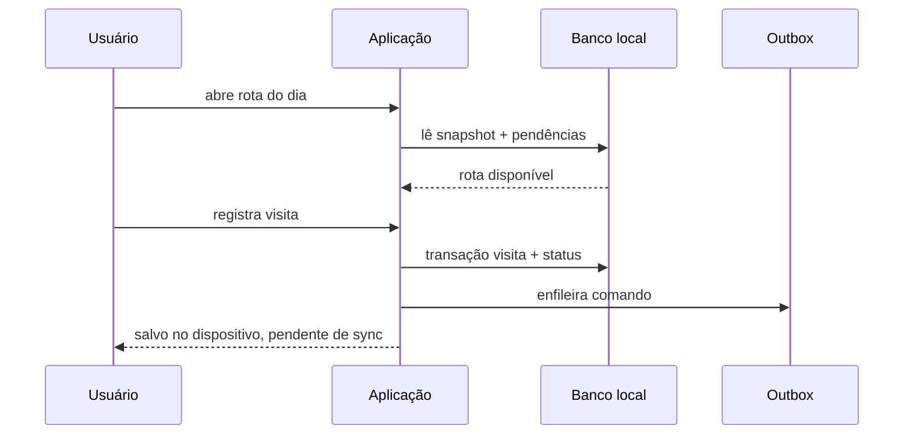

# Estratégia offline-first

## Definição

Offline-first significa que a operação de campo principal continua utilizável sem conexão depois de um bootstrap autenticado e sincronizado. A interface lê do armazenamento local e confirma ações localmente; a nuvem é reconciliada posteriormente. Não significa que toda integração externa funcione offline.

## Estados de conectividade e dados

A UI deve distinguir:

- **online e sincronizado**;
- **online sincronizando**;
- **offline com dados disponíveis**;
- **offline sem dados baixados**;
- **alterações pendentes**;
- **falha que exige retry**;
- **conflito que exige decisão**;
- **sessão expirada**.

“Salvo” significa persistido localmente. “Sincronizado” significa confirmado remotamente.

## Matriz funcional

| Funcionalidade | Comportamento offline alvo | Limites |
| --- | --- | --- |
| Consultar rota do dia | Deve funcionar integralmente com último snapshot local e pendências locais aplicadas | mostrar horário da última sincronização |
| Consultar clientes | Deve listar e buscar clientes já sincronizados | paginação/cache parcial deve ser explícito |
| Ficha do cliente | Deve abrir dados locais, localização e resumo | indicar campos possivelmente desatualizados |
| Histórico de visitas | Deve mostrar histórico local baixado e visitas pendentes | histórico antigo pode ser parcial conforme política de retenção |
| Registrar visita | Deve criar UUID local, persistir visita e enfileirar sync | anexos futuros exigirão estratégia própria |
| Registrar necessidade | Deve ser salva junto da visita offline | enquanto for campo de visita, segue a mesma operação |
| Alterar status da rota | Deve atualizar parada localmente e enfileirar comando | visita + conclusão precisam ser um comando lógico |
| Reordenar rota | Deve funcionar localmente e produzir uma operação de rota | conflito entre dispositivos não pode ser resolvido item a item |
| Editar cliente | Deve atualizar cópia local e enfileirar patch | conflitos campo a campo devem ser apresentados quando materiais |
| Mapa | Deve mostrar marcadores/linha se a biblioteca e dados já estiverem carregados | tiles públicos podem faltar; lista continua sendo fallback operacional |
| Geocodificação | Não funciona offline | manter dados e oferecer retry quando online |
| GPS manual | Pode capturar coordenadas offline se navegador/OS permitirem | salvar localmente; não rastrear continuamente |
| Autenticação | Login inicial e renovação exigem rede | sessão válida pode permitir modo offline por janela limitada e política explícita |
| Logout | Deve funcionar localmente e apagar dados do usuário | revogação remota pode ficar pendente se offline |

## Jornada sem conexão

## Bootstrap e disponibilidade

1. Primeiro login exige rede.
2. Após autenticação, o app baixa um conjunto mínimo: usuário, clientes ativos necessários, rota atual e janela de visitas.
3. O conjunto e o instante da última sincronização são persistidos por usuário.
4. O app só anuncia “pronto para trabalhar offline” após concluir o bootstrap.
5. Se o bootstrap nunca ocorreu, a tela offline explica que os dados não estão disponíveis.

## Política de dados locais

Proposta inicial a validar com volume real:

- todos os clientes ativos do usuário;
- rota de hoje e uma pequena janela passada/futura;
- últimas visitas necessárias à operação, com paginação histórica;
- outbox e conflitos sem expiração automática;
- metadados de sync e schema local.

Não armazenar respostas brutas de geocodificação, secrets ou tokens fora do mecanismo oficial do Supabase.

## Escrita local

Cada comando deve executar uma transação local única:

1. validar regra de domínio;
2. atualizar projeção local;
3. inserir operação na outbox;
4. confirmar para a UI;
5. agendar sincronização se online.

Se a outbox não puder ser gravada, a mutação local também deve falhar. Isso evita estado local sem intenção sincronizável.

## UX obrigatória

- indicador persistente e discreto de conectividade/sync;
- contagem de alterações pendentes;
- confirmação “salvo neste dispositivo” quando offline;
- botão de tentar novamente em falhas;
- conflito nunca escondido por toast transitório;
- ações principais continuam grandes e acessíveis;
- mapa nunca bloqueia lista/execução da rota.

## Mapas offline

Na primeira fase offline, não prometer tiles offline. Marcadores e sequência podem ser renderizados sobre um estado neutro, mas a lista é o fallback. Cache/download de tiles exige licença, quota, tamanho e política do provedor; não deve reutilizar indiscriminadamente os tiles públicos do OpenStreetMap.

## Autenticação offline

Uma sessão previamente válida pode liberar dados locais por um período configurado, desde que:

- o usuário seja o mesmo da partição local;
- não tenha ocorrido logout local;
- a sessão não esteja além da janela offline aceita;
- ações sejam marcadas pendentes e revalidadas na reconexão.

O app não deve inventar autenticação local independente. Ao reconectar, falha de refresh bloqueia sync e exige login sem apagar pendências antes de oferecer recuperação segura.

## Critérios para considerar uma tela offline-ready

- nenhuma leitura operacional depende diretamente de Supabase;
- reload sem rede mantém a tela após app shell instalado;
- toda escrita possui outbox atômica;
- estados pendente/erro/conflito são visíveis;
- troca de usuário não vaza dados;
- testes cobrem interrupção antes, durante e depois da mutação.
