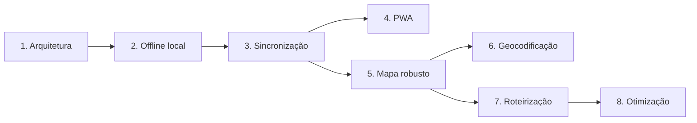

# Roadmap técnico

As fases são sequenciais por dependência, não promessas de calendário. Cada fase exige aceite e autorização antes da implementação seguinte.

## Fase 1 — Consolidação arquitetural

**Objetivo:** tornar regras, schema e segurança explícitos.

- concluir documentação e ADRs;
- versionar schema, constraints e RLS após inspeção/autorização;
- definir tipos, invariantes e casos de uso;
- definir versionamento, UUID e idempotência;
- tornar visita/status e reordenação atomicamente projetáveis;
- escolher armazenamento local por protótipo e medição;
- selecionar ferramentas de teste sem instalá-las prematuramente.

**Saída:** contratos estáveis e plano de migrations aprovado.

## Fase 2 — Offline local

**Objetivo:** ler e escrever localmente sem sincronização completa.

- base local particionada por usuário;
- migrations locais;
- repositórios locais;
- bootstrap de clientes, rota e histórico mínimo;
- comandos locais com outbox atômica;
- indicadores de estado pendente;
- logout/limpeza seguros.

**Saída:** operação local sobre dados previamente baixados, ainda com sync limitado/controlado.

## Fase 3 — Sincronização

**Objetivo:** replicação confiável entre dispositivo e Supabase.

- push idempotente;
- pull incremental e tombstones;
- retries/backoff;
- visita + conclusão atômicas;
- rota versionada e comando de reordenação;
- conflitos de Cliente e Rota;
- observabilidade e recuperação.

**Saída:** jornadas essenciais aprovadas em rede instável e múltiplos dispositivos.

## Fase 4 — PWA

**Objetivo:** app shell instalável e confiável.

- manifest, ícones e metadata;
- Service Worker versionado;
- precache de assets;
- estratégia de atualização/rollback;
- fallback offline;
- testes iOS/Android;
- política de caches autenticados.

**Saída:** instalação e reload offline sem comprometer dados/sessão.

## Fase 5 — Mapa e geolocalização robusta

**Objetivo:** mapa resiliente e localização auditável.

- fallback sem tiles;
- provider/licença para cache offline, se necessário;
- qualidade/origem da localização;
- edição e confirmação consistentes;
- desempenho com rotas maiores;
- acessibilidade e navegação externa.

**Saída:** mapa não bloqueia execução e respeita privacidade/licenças.

## Fase 6 — Geocodificação

**Objetivo:** consolidar geocodificação de produção.

- benchmark com endereços brasileiros anonimizados;
- thresholds e revisão manual;
- quota/rate limiting;
- retries e observabilidade;
- política de privacidade/termos;
- fallback e troca de provedor;
- processamento gradual de base existente, se autorizado.

**Saída:** coordenadas confiáveis sem sobrescrita silenciosa.

## Fase 7 — Roteirização

**Objetivo:** representar trajetos reais sem otimização automática.

- interface `RouteEngine` independente de fornecedor;
- avaliação de provedores e custos;
- Directions/ETA online com cache permitido;
- falha e fallback para sequência manual;
- monitoramento de quota e precisão.

**Saída:** trajeto viário explícito, sem alterar ordem do usuário.

## Fase 8 — Otimização inteligente

**Objetivo:** sugerir ordem eficiente com controle humano.

- função objetivo e restrições comerciais;
- qualidade e completude dos dados;
- proposta comparável à ordem atual;
- aceite/rejeição explícitos;
- métricas de ganho;
- explicabilidade e rollback;
- otimização nunca executada silenciosamente.

**Saída:** sugestões mensuráveis e reversíveis.

## Dependências críticas

## Itens que não devem ser antecipados

- Service Worker antes de definir cache e limpeza por usuário;
- sync antes de idempotência/versionamento;
- tiles offline sem licença;
- otimização antes de geolocalização e motor de rota confiáveis;
- resolução last-write-wins silenciosa;
- dependências sem protótipo, teste e ADR.
