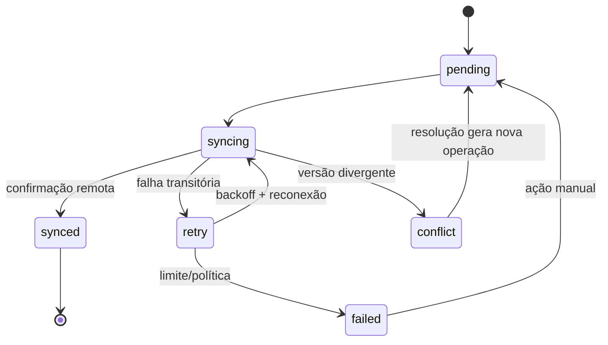

# Estratégia de sincronização

## Objetivo

Sincronizar dados locais e Supabase sem perder operações, duplicar visitas ou sobrescrever conflitos silenciosamente. Este é um projeto; nenhuma estrutura foi implementada nesta sprint.

## Modelo recomendado

Usar **outbox local + push idempotente + pull incremental**. PostgreSQL é a fonte autoritativa compartilhada; IndexedDB é a fonte imediata da UI no dispositivo.

## Registro da outbox

Campos mínimos propostos:

| Campo | Finalidade |
| --- | --- |
| `operation_id` | UUID/idempotency key |
| `user_id` | partição e validação de identidade |
| `entity_type` / `entity_id` | alvo |
| `operation` | create, update, delete ou comando de domínio |
| `payload` | dados normalizados do comando |
| `base_version` | versão lida antes da edição |
| `depends_on` | operações que precisam ser confirmadas antes |
| `created_at_local` | ordenação estável e auditoria local |
| `attempt_count` | controle de retries |
| `next_attempt_at` | backoff |
| `status` | pending, syncing, retry, conflict, failed, synced |
| `last_error_code` | diagnóstico sem segredo/dado sensível |

## IDs e criação offline

- Gerar UUID no cliente para Cliente, Visita e operações.
- O mesmo UUID é enviado ao servidor.
- Relações offline usam esses IDs desde a criação.
- O servidor aceita retry do mesmo create como sucesso idempotente quando payload/ownership são compatíveis.
- Nunca trocar ID local por ID remoto após sync.

## Push

1. Validar que sessão atual corresponde ao `user_id` da partição.
2. Selecionar operações `pending/retry` com dependências satisfeitas.
3. Marcar `syncing` de forma transacional local.
4. Enviar lote pequeno ou comando único com `operation_id`.
5. Servidor executa sob usuário autenticado e RLS.
6. Confirmar resposta/versionamento no banco local.
7. Em timeout, repetir a mesma operação; nunca criar outra chave.

Operações independentes podem ser paralelas com limite baixo. Operações da mesma entidade/agregado preservam ordem causal.

## Pull

O pull deve ser incremental por cursor do servidor, não apenas pelo relógio do dispositivo. Opções a avaliar antes de schema:

- `updated_at` + `(updated_at, id)` como cursor;
- sequência monotônica/change log por usuário;
- Supabase Realtime apenas como sinal para disparar pull, não como única fonte de verdade.

Deletes exigem tombstone ou change log retido até todos os dispositivos avançarem o cursor.

## Idempotência no servidor

Operações compostas e creates precisam de registro durável de `operation_id` ou constraint natural equivalente. A resposta deve ser repetível. Idempotência somente em memória do servidor não é suficiente.

Exemplos:

- `create_visit(operation_id, visit_id, payload, route_stop_id)` cria a visita e conclui a parada na mesma transação;
- `reorder_route(operation_id, route_id/date, base_version, ordered_stop_ids)` valida versão e atualiza o conjunto atomicamente.

Não usar `service_role`; RPC/endpoint executa com JWT do usuário e valida ownership, mantendo RLS onde aplicável.

## Retries

- backoff exponencial com jitter;
- retry automático para timeout, offline, 429 e 5xx;
- respeitar `Retry-After`;
- 401 pausa sync e solicita reautenticação;
- 403 não é transitório e deve ir para falha segura;
- 409/412 representa conflito;
- 400/422 exige correção de dados, não loop automático;
- limite de tentativas automáticas seguido de ação manual, sem descartar operação.

## Ordenação de operações

Ordem causal, não apenas cronológica global:

1. criação da entidade pai;
2. updates do mesmo agregado;
3. entidades dependentes;
4. delete/tombstone por último.

Updates consecutivos ainda não enviados podem ser compactados somente quando semanticamente equivalentes. Nunca compactar comando “registrar visita”. Reordenações pendentes da mesma rota podem ser substituídas pelo último estado completo se nenhuma execução dependente estiver entre elas.

## Conflitos

### Cliente alterado local e remotamente

- Comparar `base_version` com versão remota.
- Alterações em campos distintos podem receber merge automático auditável.
- Mesmo campo com valores diferentes gera conflito apresentado ao usuário.
- Coordenadas/localização são um grupo indivisível com seus metadados.
- Nunca aplicar last-write-wins baseado no relógio do dispositivo.

### Visita criada offline

- Create é naturalmente acumulativo, com UUID e idempotency key.
- Se o cliente foi removido/inacessível, manter visita local em conflito; não descartar.
- A conclusão da parada deve estar no mesmo comando transacional.

### Rota reordenada em dois dispositivos

- Tratar rota diária como agregado versionado.
- Enviar lista completa ordenada e `base_version`.
- Se versão divergir, rejeitar; oferecer manter ordem remota ou reaplicar ordem local sobre conjunto atual.
- Status de execução não deve ser revertido durante resolução da ordem.

### Delete futuro

- Delete local cria tombstone e operação.
- Servidor valida dependências e política de retenção.
- Tombstone remoto propaga no pull.
- Hard delete só após janela segura/auditoria definida.

## Reconexão

Disparadores complementares:

- evento `online` apenas agenda tentativa;
- retorno do app ao foreground;
- timer curto enquanto houver pendências;
- ação manual “sincronizar agora”.

Antes do push, realizar refresh de sessão. Após push, executar pull para reconciliar dados remotos concorrentes.

## Falhas e recuperação

- Outbox nunca é limpa antes de ack durável.
- Operação presa em `syncing` volta a `retry` após lease expirar.
- Migração local falha de forma bloqueante e recuperável.
- Exportação diagnóstica deve remover payloads sensíveis.
- Limpeza/reinstalação com pendências exige alerta explícito de perda potencial.

## Observabilidade

Métricas futuras: atraso até ack, operações pendentes, retries por código, conflitos por entidade, falhas de migração e tamanho local. Logs não incluem tokens, endereço completo, coordenadas precisas ou payload integral.

## Pré-requisitos de banco antes da implementação

Qualquer mudança abaixo exige sprint e autorização próprias:

- versão/`updated_at` confiável por entidade;
- protocolo de cursor e tombstones;
- idempotency ledger ou constraints equivalentes;
- comando atômico visita + parada;
- versão/comando atômico da rota diária.
